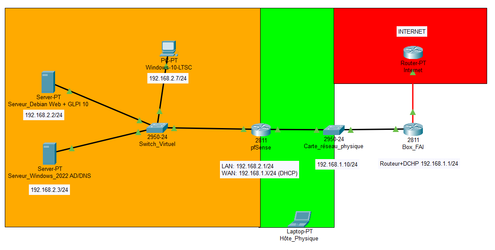

# 🎫 Projet GLPI - Système ITSM avec intégration Active Directory

Déploiement d'un outil ITSM open source (GLPI) intégré à Active Directory pour la gestion centralisée des incidents et demandes utilisateurs.

---

## 📋 Contexte

Projet autonome réalisé dans un laboratoire personnel dans le cadre d'une montée en compétences en support informatique et administration système. L'objectif est de reproduire un environnement professionnel réaliste de gestion des incidents, en s'appuyant sur les standards ITIL et une infrastructure Active Directory existante.

---

## 🎯 Objectif du projet

Déployer et **exploiter** un système ITSM (IT Service Management) open source intégré à Active Directory, permettant :

* Gestion centralisée des tickets d'incidents et de demandes
* Authentification des utilisateurs via LDAP/Active Directory
* Priorisation des incidents selon des SLA définis
* Documentation des procédures de support niveau 1
* Simulation d'un environnement de production réaliste

**L'ojectif** est de mettre en place un outil ITSM **afin de démontrer des compétences concrètes en support utilisateurs**.

---

## 🏗️ Architecture

**Composants de l'infrastructure :**

* **pfSense** : Routeur/Firewall, gestion DHCP
* **Windows Server 2022**
  * Active Directory Domain Services
  * DNS avec forwarders (8.8.8.8, 1.1.1.1)
* **Debian GNU/Linux**
  * Apache avec HTTPS (certificat auto-signé)
  * PHP 8.2
  * MariaDB 11.8
  * GLPI 10.0.16
* **Postes clients**
  * Debian (création de tickets)
* **Domaine** : `homelab.local`

**Principe** : GLPI s'authentifie auprès d'Active Directory via LDAP pour centraliser la gestion des utilisateurs et des accès.

### Architecture DNS 

```
Client Debian GLPI
    ↓ (DNS: 192.168.2.3 via DHCP pfSense)
Active Directory / DNS (192.168.2.3)
    ├─→ Requêtes internes (homelab.local) → résout directement
    └─→ Requêtes externes (github.com, etc.)
            ↓ (Forwarders)
        DNS 8.8.8.8 / 1.1.1.1
            ↓
        Internet
```

**Point critique** : Sans forwarders DNS configurés sur l'AD, le serveur GLPI ne peut pas résoudre les noms externes (mise à jour système, téléchargement GLPI, etc.).

---

### 📸 Topologie réseau



📁 [Voir la topologie détaillée →](Diagramemes/)

---

## ⚙️ Fonctionnalités réalisées

### Intégration technique

✅ Authentification centralisée via LDAP/Active Directory  
✅ Import automatique des utilisateurs AD dans GLPI  
✅ Synchronisation des groupes Active Directory  
✅ Configuration de SLA selon la priorité (Haute: 4h, Moyenne: 8h, Basse: 24h)  
✅ Configuration de SLA VIP (TTO: 1H (-30min), TTR: 2H (-40min))  
✅ Gestion des profils et rôles (Technicien, Self-Service)

### Exploitation opérationnelle

✅ **20 tickets d'incidents créés et résolus** couvrant :
* Accès et comptes (mots de passe expirés, demandes d'accès)
* Réseau et connectivité (DNS, Internet)
* Matériel - Postes de travail (performances, démarrage)
* Logiciels et applications (Office, navigateurs, licences)
* Périphériques (imprimantes, souris, clés USB)

✅ **4 procédures de support N1 documentées** :
* Réinitialisation mot de passe Active Directory
* Diagnostic connectivité réseau (approche OSI)
* Résolution DNS défaillante
* Procédure d'escalade N1 → N2

### Gestion des utilisateurs AD

* **Jean Dupont** (`jdupont`) : Profil Technicien
* **Marie Martin** (`mmartin`) : Profil Self-Service (utilisatrice - VIP)
* **Pierre Leroy** (`pleroy`) : Profil Self-Service (utilisateur)

---

## 🔧 Technologies utilisées

`GLPI 10.0.16` `Debian 13` `Apache 2.4` `PHP 8.2` `MariaDB 11.8` `LDAP` `Active Directory` `Windows Server 2022` `pfSense` `HTTPS` `ITIL`

---

## 🐛 Principaux défis techniques

Au cours du projet, plusieurs incidents ont nécessité une approche méthodique de diagnostic et de résolution :

### Extension du disque VirtualBox et conflit swap
* **Problème** : Disque Debian initial insuffisant pour GLPI, extension nécessaire
* **Impact** : Impossible d'étendre la partition avec swap active, conflit après recréation
* **Solution** : Suppression de l'ancienne référence swap dans `/etc/fstab`, configuration du nouveau swap

### Incompatibilité PHP 8.4
* **Problème** : GLPI 10.0.16 ne supporte que PHP 7.4 à 8.3 (8.4 exclu)
* **Solution** : Ajout du dépôt Sury, installation de PHP 8.2, désactivation de PHP 8.4

### Droits de fichiers refusés lors de l'installation GLPI
* **Problème** : "Accès en écriture refusé sur les fichiers de configuration"
* **Solution** : `chmod -R 775` sur les dossiers `config/`, `files/` et `marketplace/`

### Import LDAP : "Aucun utilisateur à importer"
* **Problème** : Test connexion réussi mais aucun utilisateur trouvé lors de l'import
* **Cause** : Attribut d'identifiant configuré avec `uid` au lieu de `sAMAccountName`
* **Solution** : Correction du champ "Champ de l'identifiant" en `sAMAccountName`

### Téléchargement GLPI échoue avec wget
* **Problème** : `wget` retourne erreur 404 Not Found pour toutes les versions testées
* **Solution** : Téléchargement manuel depuis le navigateur Firefox de la VM Debian

👉 **Détails et commandes de résolution** : [TROUBLESHOOTING.md](TROUBLESHOOTING.md)

---

## 📊 Résultats

### Infrastructure opérationnelle

* ✅ Serveur GLPI accessible via HTTPS (certificat auto-signé)
* ✅ Authentification centralisée via Active Directory fonctionnelle
* ✅ Import de 3 utilisateurs AD avec attribution de profils
* ✅ SLA configurés et appliqués automatiquement selon la priorité
* ✅ Base de connaissances avec 5 procédures documentées

### Métriques d'exploitation

* **Nombre de tickets traités** : 20
* **Catégories couvertes** : 5 (Matériel, Réseau, Accès, Logiciels, Périphériques)
* **Procédures documentées** : 4 (niveau N1)
* **Utilisateurs AD synchronisés** : 3
* **Taux de respect des SLA** : 100% (environnement de laboratoire)
* **Temps moyen de résolution** : 10-20 minutes selon complexité

### Validations fonctionnelles

Les tests suivants ont été réalisés avec succès :

* ✅ Authentification avec compte Active Directory (`jdupont`)
* ✅ Création de ticket par un utilisateur (`mmartin`, `pleroy`)
* ✅ Traitement de ticket par un technicien (`jdupont`)
* ✅ Application automatique des SLA selon la priorité
* ✅ Consultation de la base de connaissances
* ✅ Résolution et clôture de tickets avec documentation complète

---

## 📚 Documentation

* 📄 [Compte-rendu complet (PDF)](Documents/compte_rendu.pdf) - Analyse détaillée avec problèmes rencontrés et solutions
* 🔧 [Procédure d'installation (PDF)](Documents/procedure_installation.pdf) - Guide pas à pas du déploiement
* 🗺️ [Topologie réseau](Topologie_reseau/) - Schéma de l'infrastructure
* 🐛 [Guide de dépannage](TROUBLESHOOTING.md) - Problèmes rencontrés et solutions détaillées
* 💻 [Scripts d'installation](Scripts/) - Scripts Bash pour automatisation

---

## 🎓 Compétences démontrées

### Techniques

* Administration système Linux (Debian, Apache, MariaDB, permissions)
* Intégration LDAP/Active Directory (filtres, attributs)
* Gestion de services ITSM (GLPI, ticketing, SLA, catégorisation)
* Diagnostic réseau (modèle OSI, DNS, connectivité, forwarders)
* Sécurisation (HTTPS, gestion des mots de passe, permissions Unix)
* Virtualisation (VirtualBox, optimisation ressources)

### Méthodologiques

* Support utilisateurs niveau 1 (prise en charge, diagnostic, résolution, clôture)
* Documentation technique (procédures, clarté, reproductibilité)
* Gestion des priorités (SLA, escalade N2)
* Résolution de problèmes (approche méthodique, diagnostic par élimination)
* Autonomie (recherche de solutions, adaptation aux contraintes)

---

## 🔄 Améliorations possibles

* Déploiement de l'agent GLPI sur les postes clients pour inventaire automatique
* Configuration LDAPS (LDAP sécurisé via TLS) au lieu de LDAP simple
* Monitoring : Intégration avec Zabbix ou Nagios pour supervision
* Sauvegarde automatisée : Scripts de backup de la base de données GLPI
* Haute disponibilité : Réplication MariaDB, load balancing Apache
* Certificat SSL valide : Utilisation de Let's Encrypt
* Séparation des données : Déplacement de `/var/www/glpi/files` hors du webroot
* Automatisation : Scripts Ansible pour déploiement reproductible

