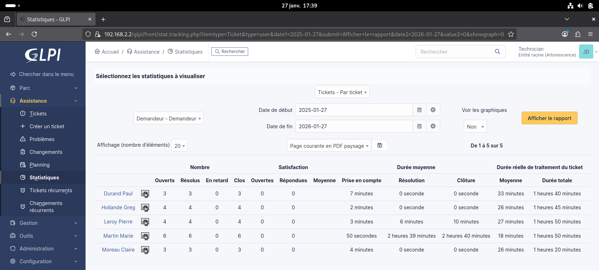
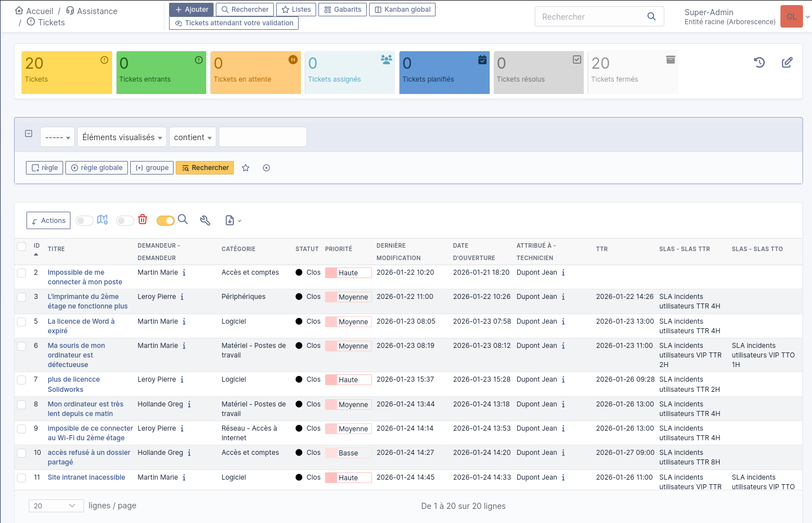
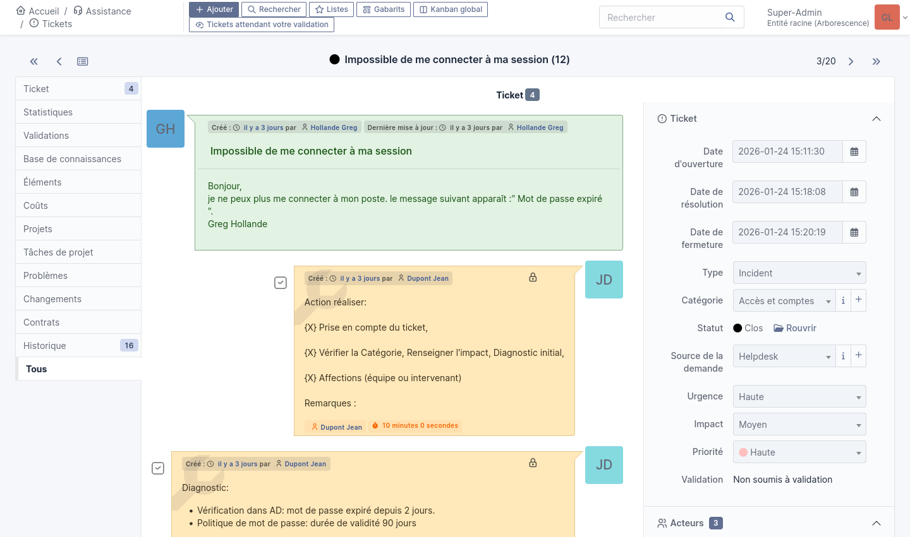
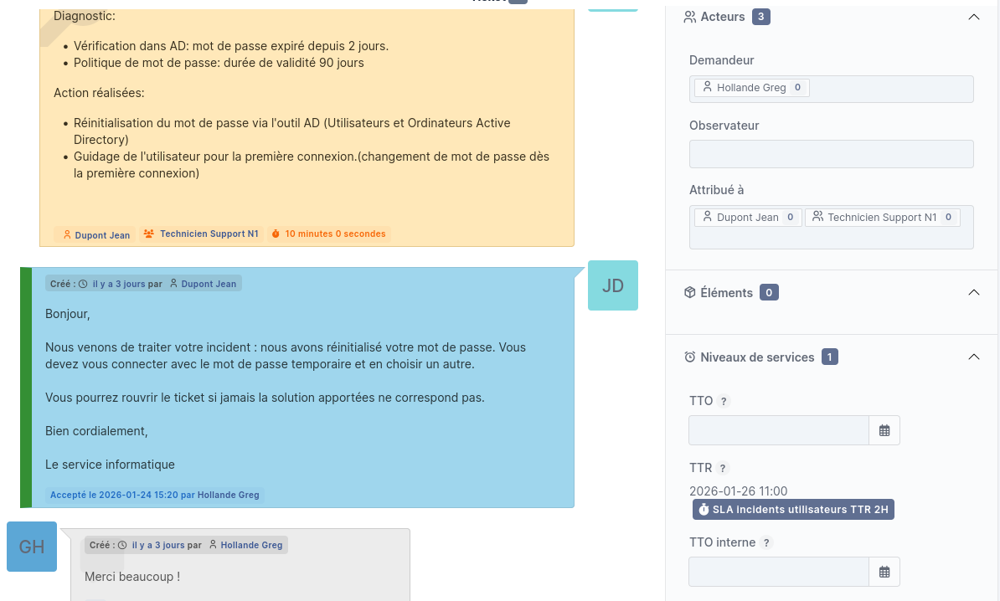
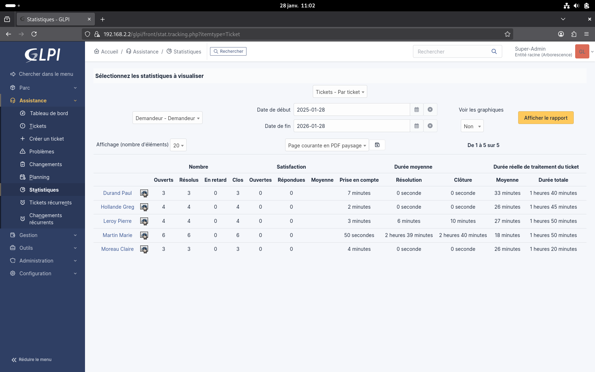
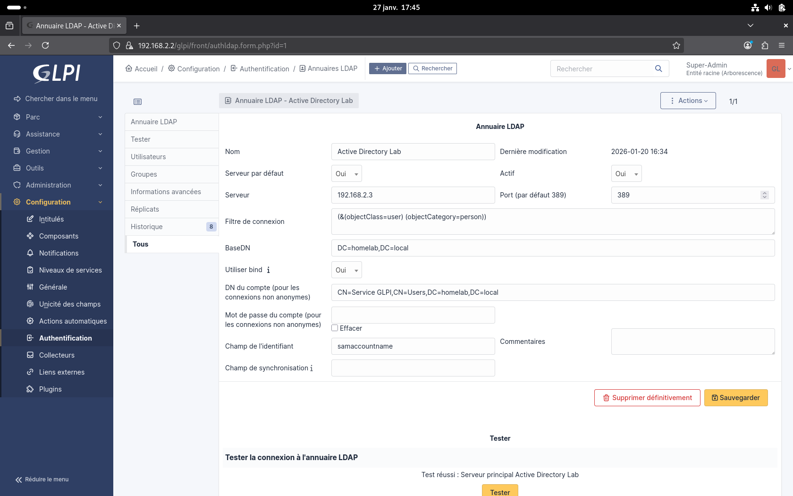
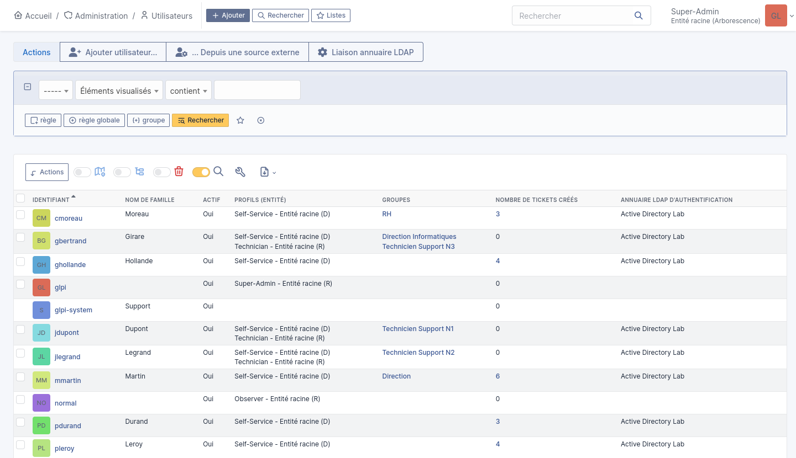
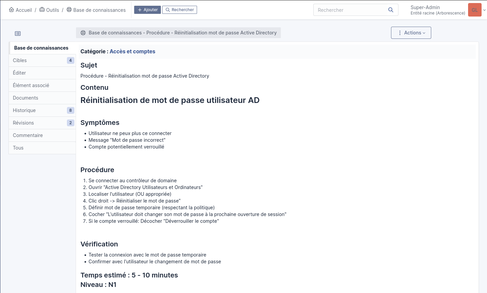
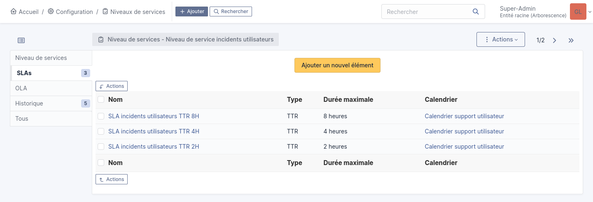
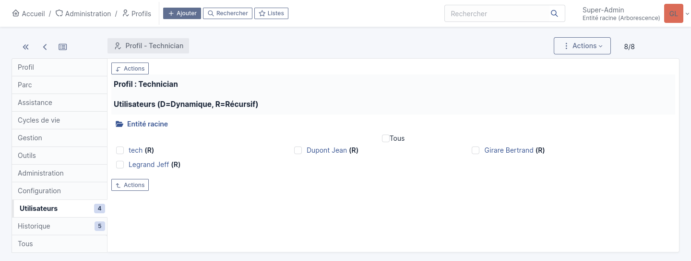

# 📸 Screenshots - Projet GLPI ITSM

Ce dossier contient les captures d'écran démontrant le fonctionnement de l'infrastructure GLPI intégrée à Active Directory.

---

## 🎫 Interface et exploitation GLPI

### 1. Dashboard GLPI (Interface Technicien)

**Connecté en tant que** : Jean Dupont (Technicien)

**Démontre** :
- Interface GLPI 10.0.16 opérationnelle
- Vue d'ensemble des tickets en cours
- Statistiques d'activité
- Navigation complète accessible

---

### 2. Liste des tickets traités

**Source** : Assistance → Tickets

**Démontre** :
- **20+ tickets d'incidents** créés et traités
- Répartition par catégories (Matériel, Réseau, Accès, Logiciels, Périphériques)
- Gestion des priorités (Haute, Moyenne, Basse)
- Statuts de résolution
- **Objectif principal du projet atteint** ✅

---

### 3. Exemple de ticket complet - Incident mot de passe AD

**Ticket** : "Impossible de me connecter à mon poste"

**Démontre** :
- **Demandeur** : Greg Hollande (utilisatrice AD)
- **Technicien assigné** : Jean Dupont
- **Catégorie** : Accès et comptes
- **Priorité** : Haute
- **Description utilisateur** : problème formulé de manière non technique
- **Diagnostic technicien** : méthodologie appliquée (vérification AD, identification cause)
- **Actions réalisées** : étapes de résolution documentées
- **Solution** : résolution claire et vérifiable
- **Méthodologie support N1** : prise en charge → diagnostic → action → résolution ✅

---

### 4. Statistiques et métriques

**Source** : Rapports GLPI ou graphique généré depuis glpi_export.csv

**Démontre** :
- **Répartition par catégorie** :
  - Accès et comptes : 5 tickets (25%)
  - Réseau - Connectivité : 4 tickets (20%)
  - Matériel - Poste de travail : 4 tickets (20%)
  - Logiciels et applications : 4 tickets (20%)
  - Périphériques : 3 tickets (15%)
- **Temps moyen de résolution** : 10-20 minutes
- **Taux de respect des SLA** : 100%
- **Approche professionnelle** avec métriques quantifiables ✅

---

## 🔐 Intégration Active Directory

### 5. Configuration LDAP Active Directory

**Source** : Configuration → Authentification → Annuaires LDAP → Active Directory Lab

**Démontre** :
- **Serveur LDAP** : 192.168.2.3 (Windows Server 2022)
- **Port** : 389 (LDAP standard)
- **BaseDN** : DC=homelab,DC=local
- **Bind DN** : CN=Service GLPI,CN=Users,DC=homelab,DC=local
- **Champ de l'identifiant** : `sAMAccountName` ← Correction critique (était `uid` initialement)
- **Test de connexion** : Réussi ✅
- **Intégration LDAP/AD fonctionnelle** ✅

---

### 6. Utilisateurs Active Directory importés

**Source** : Administration → Utilisateurs

**Démontre** :
- **3 utilisateurs AD importés** :
  - Jean Dupont (Technicien) - Source : Active Directory Lab
  - Marie Martin (Self-Service) - Source : Active Directory Lab
  - Pierre Leroy (Self-Service) - Source : Active Directory Lab
- **Import automatique** depuis l'OU `GLPI_Users` dans Active Directory
- **Authentification centralisée** opérationnelle
- **Gestion des profils** selon les rôles (Technicien vs Utilisateur)

---

## 📚 Base de connaissances et procédures

### 7. Base de connaissances - Liste des procédures

**Source** : Outils → Base de connaissances

**Démontre** :
- **5 procédures support N1** documentées :
  1. Réinitialisation mot de passe Active Directory
  2. Diagnostic connectivité réseau (approche OSI)
  3. Incident VPN
  4. Résolution DNS défaillante
  5. Procédure d'escalade N1 → N2
- **Documentation professionnelle** des interventions courantes
- **Capitalisation des connaissances** pour le support ✅

---

### 8. Exemple de procédure - Réinitialisation mot de passe AD

**Procédure** : "Réinitialisation mot de passe Active Directory"

**Démontre** :
- **Structure claire** : Symptômes → Procédure → Vérification
- **Étapes détaillées** : actions concrètes à effectuer
- **Commandes PowerShell** : outils techniques référencés
- **Temps estimé** : 5-10 minutes
- **Niveau** : N1
- **Documentation exploitable** par d'autres techniciens ✅

---

## ⚙️ Configuration et gestion

### 9. Configuration des SLA

**Source** : Configuration → Niveaux de services → SLAs

**Démontre** :
- **SLA selon priorité** :
  - Urgence Haute : TTR 4 heures
  - Urgence Moyenne : TTR 8 heures
  - Urgence Basse : TTR 24 heures
- **Gestion des délais** de résolution
- **Règles métier** pour application automatique des SLA
- **Approche ITIL** dans la gestion des incidents ✅

---

### 10. Profils et habilitations

**Source** : Administration → Profils ou Habilitations utilisateur

**Démontre** :
- **Profils GLPI** :
  - Super-Admin (glpi)
  - Technicien (jdupont)
  - Self-Service (mmartin, pleroy)
- **Séparation des privilèges** selon les rôles
- **Gestion des droits** : techniciens peuvent traiter les tickets, utilisateurs peuvent uniquement créer
- **Sécurité** : accès limité selon les responsabilités ✅

---

## 📊 Synthèse

Ces screenshots démontrent :

✅ **GLPI opérationnel** : Interface fonctionnelle, navigation complète  
✅ **Intégration LDAP/AD** : Authentification centralisée, import automatique des utilisateurs  
✅ **Exploitation réaliste** : 20+ tickets d'incidents traités avec méthodologie N1  
✅ **Documentation professionnelle** : 5 procédures support, base de connaissances exploitable  
✅ **Gestion des priorités** : SLA configurés selon urgence, respect des délais  
✅ **Métriques quantifiables** : Statistiques, répartition par catégorie, temps de résolution  

**Résultat** : Environnement ITSM complet et opérationnel reproduisant un service support d'entreprise.

---

## 🔗 Documentation complète

* 📄 [Compte-rendu du projet](../Documents/compte_rendu.pdf)
* 📄 [Procédure technicien N1](../Documents/Procedure_base_de_connaissance_technicien/)
* 🐛 [Guide de dépannage](../troubleshooting.md)
* 🗺️ [Topologie réseau](../Diagrammes/)
* 📊 [Données brutes tickets (CSV)](../Documents/glpi.csv)
