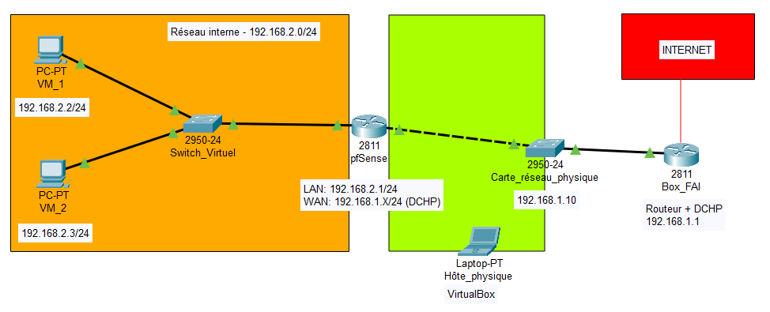

# 🌐 Homelab virtualisé avec pfSense

Infrastructure réseau virtualisée avec pare-feu pfSense, séparation LAN/WAN et environnement multi-OS pour simulation d'entreprise.

---

## 📋 Contexte

Projet autonome réalisé après l'obtention d'un BTS CIEL option IR. L'objectif est de créer un environnement de test réseau réaliste permettant d'expérimenter la configuration de pare-feu, la segmentation réseau et l'administration multi-OS.

---

## 🎯 Objectif du projet

Concevoir et déployer un **homelab réseau virtualisé** reproduisant une infrastructure d'entreprise :

* Pare-feu dédié pour le filtrage et la sécurité
* Séparation réseau LAN/WAN
* Environnement isolé pour tests et expérimentations
* Support de plusieurs machines clientes et serveurs

**But pédagogique** : Comprendre l'architecture réseau d'entreprise, les flux de trafic et le rôle central du pare-feu.

---

## 🏗️ Architecture

**Environnement de virtualisation :**

* **Système hôte** : Kali Linux
* **Hyperviseur** : VirtualBox
* **Pare-feu** : pfSense
  * Interface WAN : Connectée à la box Internet
  * Interface LAN : Réseau interne isolé (192.168.2.0/24)
* **Machines virtuelles** :
  * Debian 12 (client Linux)
  * Windows Server 2022 (serveur AD/DNS)

**Principe** : pfSense agit comme passerelle entre le réseau interne (LAN) et Internet (WAN), avec filtrage et contrôle des flux.

### 📸 Topologie réseau

📁 [Voir les schémas détaillés →](Diagrammes/)

---

## ⚙️ Fonctionnalités réalisées

✅ Pare-feu pfSense opérationnel avec règles de filtrage  
✅ Séparation LAN/WAN fonctionnelle  
✅ Accès Internet depuis le LAN via NAT  
✅ Communication contrôlée entre machines virtuelles  
✅ Infrastructure isolée du réseau local principal  
✅ Environnement évolutif pour ajout de nouveaux services

---

## 🔧 Technologies utilisées

`pfSense` `VirtualBox` `NAT` `Firewall` `LAN/WAN` `Kali Linux` `Debian 12` `Windows Server 2022`

---

## 🐛 Principaux défis techniques

### Contraintes matérielles

**Limitation** : Une seule carte réseau physique disponible sur la machine hôte

**Impact** :
* NAT fonctionnel mais avec limitations
* Segmentation physique impossible
* Pas d'implémentation de VLAN physiques

**Apprentissage** : Cette contrainte a permis de comprendre l'importance du matériel réseau dans une architecture professionnelle et de travailler dans un environnement non idéal (comme cela peut arriver en entreprise).

### Configuration des interfaces VirtualBox

**Problème** : VirtualBox ne proposait pas automatiquement plusieurs adaptateurs réseau sur Kali Linux

**Solution** : Configuration manuelle des interfaces via `VBoxManage`

**Compétences développées** :
* Compréhension des modes réseau VirtualBox (NAT, Bridged, Internal)
* Manipulation de la ligne de commande VirtualBox
* Impact des modes réseau sur l'architecture globale

👉 **Détails techniques** : [TROUBLESHOOTING.md](TROUBLESHOOTING.md)

---

## 📊 Résultats

* ✅ Infrastructure réseau fonctionnelle et isolée
* ✅ Pare-feu opérationnel avec règles de filtrage configurées
* ✅ Tests de communication validés entre LAN et WAN
* ✅ Environnement stable pour expérimentation continue

---

## 📚 Documentation

* 📄 [Compte-rendu complet (PDF)](docs/Projet_Homelab_Compte_rendu.pdf) - Documentation détaillée du projet
* 🗺️ [Schémas réseau](diagrammes/) - Topologie de l'infrastructure
* 🐛 [Guide de dépannage](TROUBLESHOOTING.md) - Configuration VirtualBox et résolution de problèmes

---

## 🎓 Compétences démontrées

* Déploiement et configuration d'un pare-feu pfSense
* Gestion de la segmentation réseau LAN/WAN
* Configuration avancée VirtualBox (modes réseau, VBoxManage)
* Conception d'architecture réseau virtualisée
* Adaptation aux contraintes matérielles
* Création d'environnement de test professionnel

---

## 🔄 Améliorations possibles

**Avec matériel adapté (plusieurs cartes réseau physiques)** :
* Mise en place de VLAN pour segmentation avancée (Utilisateurs, Serveurs, Admin, DMZ)
* Implémentation d'une DMZ pour services publics
* Ajout d'un IDS/IPS (Snort/Suricata) sur pfSense

**Supervision et monitoring** :
* Centralisation des logs (ELK Stack ou Graylog)
* Monitoring réseau (Zabbix ou Nagios)
* Graphiques de trafic (pfSense built-in + RRDTool)

**Haute disponibilité** :
* Configuration CARP (failover pfSense)
* Sauvegarde automatisée des configurations
* Plan de reprise d'activité (PRA)
