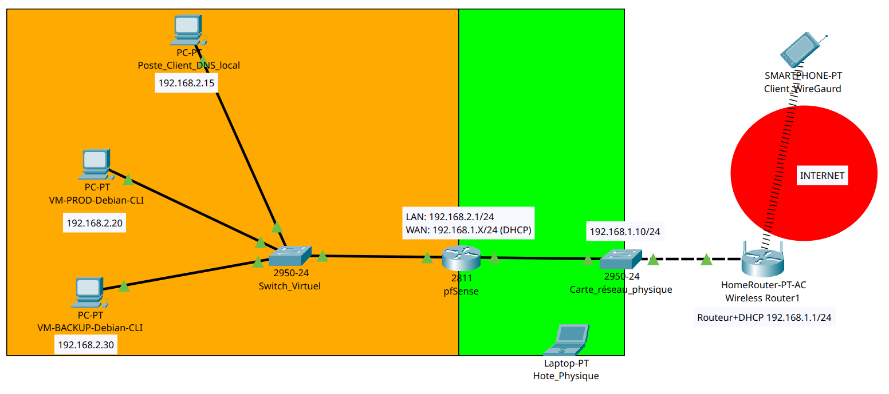

# 🛠️ SI-Lab — Infrastructure résiliente avec Plan de Reprise d'Activité (PRA)

Déploiement d'une infrastructure sur un poste Debian (DNS, Web, VPN, Firewall, Supervision, Sauvegarde), entièrement gérée en Infrastructure as Code via Ansible, et validée par un exercice de Reprise d'Activité (PRA) basé sur une attaque réelle.

---

## 📋 Contexte

Projet autonome réalisé en laboratoire personnel visant à répondre à une problématique concrète rencontrée en entreprise :

> Comment garantir la continuité minimale d'un système d'information **sans haute disponibilité** et avec des ressources limitées ?

Dans de nombreuses PME ou environnements de test, l'infrastructure repose sur une seule machine, où toute panne devient critique. Ce projet propose une solution réaliste basée sur la reconstruction rapide (PRA), une alternative efficace à la tolérance de panne.

---

## 🎯 Objectif du projet

Mettre en place une infrastructure complète capable d'être :

* Déployée automatiquement
* Supervisée en temps réel
* Sauvegardée de manière sécurisée
* Restaurée rapidement après incident

### Objectif principal

Assurer une **restauration fonctionnelle complète en moins de 10 minutes** après une panne ou une compromission.

### Objectifs techniques

* **Automatisation complète** du déploiement via Ansible (Infrastructure as Code)
* **Supervision en temps réel** avec système d'alertes (Netdata)
* **Sauvegarde chiffrée et versionnée** (Restic + Ansible Vault)
* **Validation de la résilience** : simulation d'une attaque réelle (Red Team) et test du PRA opérationnel (Blue Team)
* **Documentation** des incidents rencontrés et de la procédure de reprise

---

## 🏗️ Architecture

**Composants de l'infrastructure :**

#### 🖥️ Serveur de production (srv-prod — `192.168.1.32`)
* **OS** : Debian 12/13 (CLI)
* **Services hébergés** :
  * DNS (Bind9)
  * Web (Nginx)
  * VPN (WireGuard) — accès distant sécurisé, y compris client mobile Android
  * Firewall (nftables)
  * Supervision (Netdata v2.10.3)
* **Sauvegarde** :
  * Outil : Restic (chiffrée, mots de passe gérés via Ansible Vault)
  * Fréquence : toutes les **4 heures**
  * Stockage : local
* **Rôle** : fournir les services critiques et permettre une restauration rapide (PRA)

#### 💾 Serveur de sauvegarde distant (srv-backup — `192.168.1.33`)
* **OS** : Debian 12/13 (CLI)
* **Synchronisation** : quotidienne (1 fois par jour) via Restic (chiffrée)
* **Sécurité** : SSH avec authentification par clé uniquement (pas de mot de passe)
* **Rôle** :
  * stockage externalisé des sauvegardes
  * protection contre la perte du serveur principal
  * la corruption des données
  * les attaques par ransomware

#### ⚔️ Machine d'attaque (kali-attacker)
* **OS** : Kali Linux
* **Rôle** : simuler des attaques pour valider la résilience du système
* **Statut** : Phase 1 (reconnaissance `nmap`) en cours — Phase 1.2 (scan complet des ports) en attente

### 🔁 Principe de fonctionnement

L'infrastructure repose sur un modèle **reconstructible à la demande** :

* Les services ne sont **pas réparés manuellement**
* Ils sont **redéployés automatiquement** via Ansible
* Les données sont **restaurées depuis les sauvegardes Restic**
* La **dissociation des sauvegardes** (locales et distantes) garantit la résilience face aux incidents majeurs, y compris les attaques par ransomware

### ⚙️ Gestion de la configuration (Ansible)

* Rôles Ansible centralisés dans `/opt/si-lab/ansible/`, un rôle dédié par service (Bind9, Nginx, WireGuard, nftables, Netdata, Restic)
* Séparation stricte des comptes de service : `ansible` (déploiement), `restic` (sauvegarde), `machine` (usage courant) — cloisonnement des accès par fonction
* Objectif : toute reconstruction d'un service passe uniquement par un playbook, jamais par une intervention manuelle

---
## 📸 Topologie réseau

📁 [Voir la topologie détaillée →](Diagrammes/)

---

## ⚙️ Fonctionnalités réalisées

### DNS (Bind9)
✅ Zone interne `lab.local`, résolution des services du lab
✅ Canal de statistiques (`statistics-channels`) exposé pour l'intégration avec Netdata

### Web (Nginx)
✅ Service web de base pour les besoins du lab
✅ Logs exploités par le collecteur `weblog` de Netdata

### VPN (WireGuard)
✅ Rôle Ansible de déploiement pour l'accès distant sécurisé
✅ Extension du rôle pour un client mobile Android, avec génération automatique d'un QR code de configuration

### Firewall (nftables)
✅ Politique de filtrage par défaut en `drop` sur la chaîne `input`
⚠️ Découverte d'une misconfiguration critique (règle de limitation de débit SYN annulant de fait la politique par défaut) — volontairement conservée comme **vecteur d'attaque réel** pour le PRA, plutôt que remplacée par une vulnérabilité artificielle (cf. `troubleshooting.md`)

### Supervision (Netdata v2.10.3)
✅ Collecteurs `go.d` personnalisés : Nginx, Bind9, WireGuard, unités systemd, weblogs
🔄 Configuration d'alertes de santé (`health.d/`) personnalisées — debug en cours sur un problème d'alertes silencieusement ignorées (cf. `troubleshooting.md`)

### Sauvegarde (Restic + Ansible Vault)
✅ Sauvegardes chiffrées locales toutes les 4h sur srv-prod
✅ Synchronisation quotidienne vers srv-backup (SSH par clé uniquement)
✅ Intégration d'Ansible Vault pour éliminer les mots de passe en clair des scripts Restic : déploiement de fichiers de mots de passe via templates Jinja2 avec permissions strictes

### Client de test
✅ Client Linux Mint utilisé pour valider la résolution DNS split interne/externe (cf. `troubleshooting.md`)
✅ Client Smartphone utilisé pour valider le fonctionnement de WireGuard (cf. `troubleshooting.md`)

---

## 🔧 Technologies utilisées

`Debian 12/13` `Ansible` `Ansible Vault` `Bind9` `Nginx` `WireGuard` `nftables` `Netdata 2.10.3` `Restic` `Kali Linux` `systemd-resolved`

---

## 🐛 Principaux défis techniques

Au cours du projet, plusieurs incidents ont nécessité une approche méthodique de diagnostic et de résolution :
 
* **Installation Ansible** : échec via APT/DPKG, résolu par une installation via `pip`
* **Ansible (rôles & playbooks)** : nombreuses erreurs de jeunesse (fautes de frappe, variables mal résolues, ordre des tâches incorrect, handlers trop tôt) corrigées par l'ajout progressif de mécanismes de validation (`stat`, `register`, `fail`, `debug`, `creates`)
* **nftables** : service en échec au redémarrage à cause d'une règle référençant l'interface `wg0` avant sa création par WireGuard (ordre de démarrage), et une règle de limitation de débit SYN trop permissive annulant de fait la politique `drop` par défaut
* **DNS / Bind9** : bloc `statistics-channels` mal placé (imbriqué dans `options {}`) provoquant un échec de `named-checkconf` ; ICMP et port 53 bloqués en entrant faute de règles nftables dédiées ; résolution DNS split incorrecte côté client Linux Mint (ancienne configuration, IPv6 prioritaire, domaine de recherche absent), corrigée via `ipv4.dns-search lab.local` et désactivation d'IPv6
* **WireGuard** : absence de handshake causée par une IP publique incorrecte dans la configuration client ; plusieurs bugs Ansible lors du déploiement du rôle (lecture de clé, nom d'interface, IP forwarding)
* **QR Code (client Android)** : rendu illisible en terminal Debian (caractères Unicode non gérés) — résolu par une génération en `.png` publiée via le serveur web
* **Netdata** : installation bloquée par plusieurs obstacles successifs (accès réseau, dépôts APT non supportés), résolue via le script officiel `kickstart.sh` ; alertes de santé personnalisées ne se déclenchant pas — 🔄 **problème en cours de résolution**
* **Nginx / HTTPS** : VirtualHosts mal séparés (Netdata masquant le site principal), liens symboliques cassés, certificats SSL jamais recréés lors d'un redéploiement Ansible complet
* **Restic (local & distant)** : permissions incorrectes (fichiers sensibles, snapshots, SSH/SFTP), syntaxe `RESTIC_SFTP_COMMAND` incorrecte, résolution d'hôte échouant sous sudo
* **Ansible Vault** : mot de passe Restic en clair dans les scripts, fichier `vault.yml` illisible après création via sudo — corrigés par `RESTIC_PASSWORD_FILE` chiffré et séparation stricte des comptes de service

👉 **Détails techniques complets** : [troubleshooting.md](troubleshooting.md)

---

## 📊 État d'avancement

| Volet | Statut |
|---|---|
| Infrastructure de base (DNS, Web, VPN, Firewall) | ✅ Déployée et fonctionnelle via Ansible |
| Supervision Netdata (collecteurs) | ✅ Opérationnelle |
| Supervision Netdata (alertes santé personnalisées) | 🔄 En cours de debug |
| Sauvegarde Restic + Ansible Vault | ✅ Opérationnelle |
| PRA — Phase 1 : Reconnaissance (nmap) | 🔄 En cours |
| PRA — Phase 1.2 : Scan complet des ports | ⏳ En attente |
| PRA — Exploitation / Restauration | ⏳ Non démarré |

---

## 🎓 Compétences démontrées

### Techniques
* Infrastructure as Code (Ansible : rôles, séparation des comptes de service)
* Administration système Linux (Debian, services réseau)
* Sécurité réseau (nftables, VPN WireGuard, cloisonnement des accès)
* Supervision (Netdata, collecteurs `go.d` personnalisés, alertes)
* Sauvegarde et continuité d'activité (Restic, chiffrement, dissociation locale/distante)
* Gestion des secrets (Ansible Vault)

### Méthodologiques
* Diagnostic méthodique (réseau, DNS, permissions, configuration)
* Documentation technique (procédures, reproductibilité)
* Approche réaliste de sécurité : utilisation d'une vraie faille découverte plutôt qu'un scénario artificiel
* Autonomie (recherche de solutions, adaptation aux contraintes du lab)

---

## 🔄 Prochaines étapes

* Finaliser le debug Netdata (inspection de l'API `alarms` et des logs de démarrage)
* Exécuter le PRA complet : reconnaissance → exploitation de la faille nftables réelle → restauration depuis srv-backup
* Mesurer et documenter le temps de restauration réel (objectif : < 10 minutes)
* Ajouter le retour d'expérience du PRA (scénario d'attaque, chronologie, résultats) à ce document

